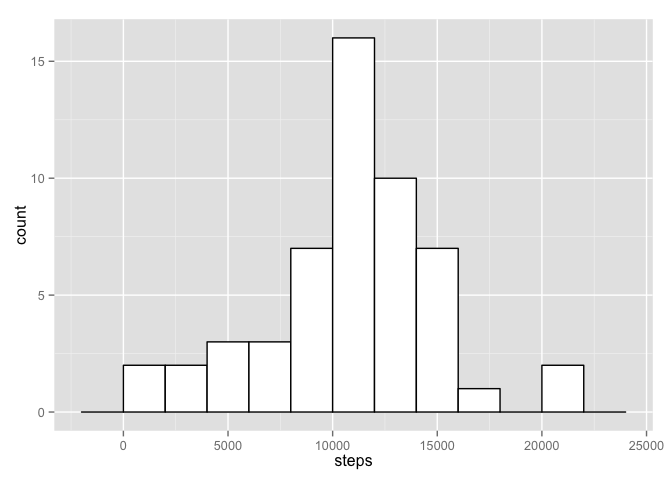
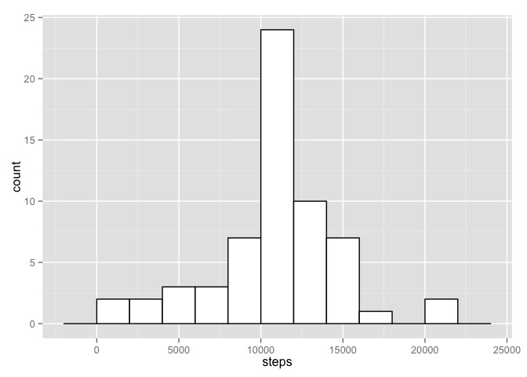
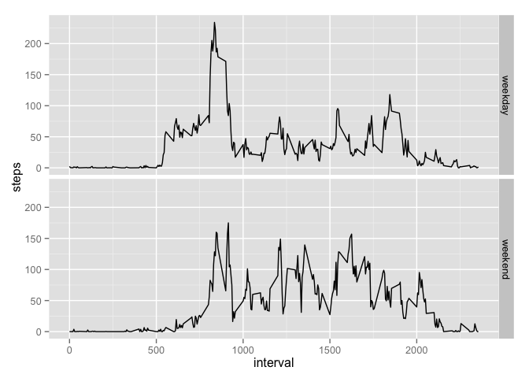

# Reproducible Research: Peer Assessment 1


## Loading and preprocessing the data

First of all, we'll carry out the following operations to get a tidy dataset onto
which we'll perform the analysis:

1. Load the data from '''activity.csv''' and store it into a dataset:


```r
unzip(zipfile = "activity.zip");
steps <- read.csv(file = "activity.csv", header = TRUE);
```
2. Transform the second column into a friendly date format:


```r
library(lubridate);
steps[,2] <- ymd(as.character(steps[,2]));
```

## What is mean total number of steps taken per day?

Next, we'll depict the number of steps taken per day and then calculate the 
mean and median of total steps per day.

1. Make a histogram of the total number of steps taken each day:


```r
library(dplyr);
steps.bydate <- steps %>% group_by(date) %>% summarise(steps = sum(steps));
library(ggplot2);
ggplot(steps.bydate, aes(x=steps)) + geom_histogram(binwidth=2000, colour="black", fill="white");
```

 

2. Calculate and report the mean and median total number of steps taken per day


```r
mean(steps.bydate$steps, na.rm = TRUE);
```

```
## [1] 10766.19
```

```r
median(steps.bydate$steps, na.rm = TRUE);
```

```
## [1] 10765
```

## What is the average daily activity pattern?

Now we'll group the steps by interval, and calculate the mean of steps taken each
time interval, taking into account all days in the dataset. With this information 
we'll answer the following questions:

1. Make a time series plot of the 5-minute interval (x-axis) and the average 
number of steps taken, averaged across all days (y-axis)


```r
steps.byinterval <- steps %>% group_by(interval) %>% summarise(steps = mean(steps, na.rm = TRUE));
ggplot(steps.byinterval, aes(x = interval, y = steps)) + geom_line();
```

 

2. Which 5-minute interval, on average across all the days in the dataset, 
contains the maximum number of steps?


```r
steps.byinterval %>% arrange(desc(steps)) %>% slice(1);
```

```
## Source: local data frame [1 x 2]
## 
##   interval    steps
## 1      835 206.1698
```

## Imputing missing values

Let's calculate the number of missing values and try to amend them.

1. Calculate and report the total number of missing values in the dataset 


```r
sum(is.na(steps$steps));
```

```
## [1] 2304
```

2. Devise a strategy for filling in all of the missing values in the dataset.

The strategy will be to fill the missing values with the median for that interval.

3. Create a new dataset that is equal to the original dataset but with the missing data filled in.


```r
steps.filled <- steps %>% group_by(interval) %>% mutate(steps = ifelse(is.na(steps), mean(steps, na.rm = TRUE), steps));
```

4. Make a histogram of the total number of steps taken each day and Calculate and report the mean and median total number of steps taken per day.

Histogram after filling values:


```r
steps.bydate.filled <- steps.filled %>% group_by(date) %>% summarise(steps = sum(steps));
ggplot(steps.bydate.filled, aes(x=steps)) + geom_histogram(binwidth=2000, colour="black", fill="white");
```

 

Mean and median recalculated:


```r
mean(steps.bydate.filled$steps, na.rm = TRUE);
```

```
## [1] 10766.19
```

```r
median(steps.bydate.filled$steps, na.rm = TRUE);
```

```
## [1] 10766.19
```

__Do these values differ from the estimates from the first part of the assignment?__

Yes, the histogram shows that frequency of values close to the median is much 
higher, as many intervals have now the median value.  
Recalculating the mean and median shows that median now is equal to the mean.

__What is the impact of imputing missing data on the estimates of the total daily number of steps?__

The impact of substituting missing data by estimates is that values of the 
distribution closer to the median are now more frequent.

## Are there differences in activity patterns between weekdays and weekends?

1. Create a new factor variable in the dataset with two levels – “weekday” and “weekend” indicating whether a given date is a weekday or weekend day.


```r
steps <- steps %>% mutate(weekday = as.factor(ifelse(wday(steps$date) == 1 | wday(steps$date) == 7, "weekend", "weekday")));
```

2. Make a panel plot containing a time series plot of the 5-minute interval (x-axis) and the average number of steps taken, averaged across all weekday days or weekend days (y-axis).


```r
steps.bydayinterval <- steps %>% group_by(interval, weekday) %>% summarise(steps = mean(steps, na.rm = TRUE));
ggplot(steps.bydayinterval, aes(x = interval, y = steps)) + facet_grid(weekday~.) + geom_line();
```

 
